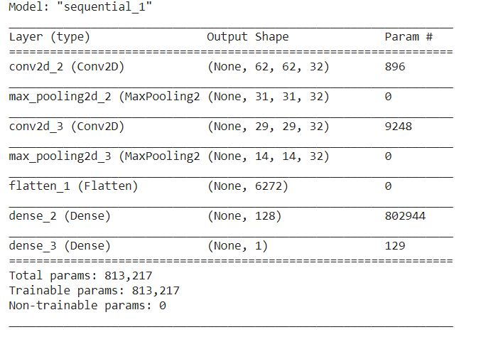
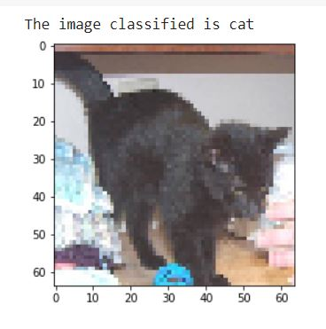
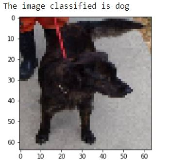

# Image-Classification

Dataset Available: https://drive.google.com/drive/folders/1IcJpW4OrcC9wj4HSOXoTKkBOi_Hq_pSm?usp=sharing

## CNN for Image Classification
CNN image classifications take an input image, process it and classify it under certain categories (Eg., Dog, Cat, Tiger, Lion). Computers sees an input image as array of pixels and it depends on the image resolution. Based on the image resolution, it will see h x w x d (h = Height, w = Width, d = Dimension).

## Cnn Summary

### Modelling
Following parameters are used for measuring:
optimizer = 'adam',
loss = 'binary_crossentropy', 
metrics = 'accuracy'

## Output Screnshots

 , 
